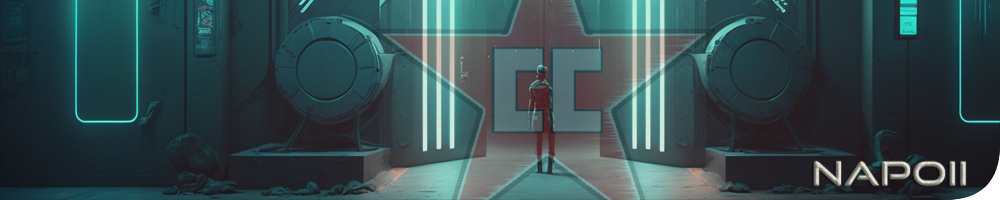

<p align="center">
<a href="https://github.com/NapoII">
    
</a>
</p>

<center>

# Rust-Bots
</center>

<p align="center">
<a href="https://github.com/NapoII/Rust-Bots/archive/refs/heads/main.zip">
    
</a>

<a href="https://github.com/NapoII/Rust-Bots/archive/refs/heads/main.zip">
    
</a>

<a href="https://github.com/NapoII/Rust-Bots/blob/main/LICENSE">
    
</a>

<a href="https://github.com/NapoII/Rust-Bots/actions">
    
</a>

<a href="https://github.com/NapoII/Rust-Bots/issues">
    
</a>

<a href="https://github.com/NapoII/Rust-Bots/stargazers">
    
</a>

<a href="https://discord.gg/g7EW4P65">
    
</a>
</p>

This repository contains a collection of three bots for the Rust game:

    Fishing bot - A bot that automates the fishing process in the game.
    Auto sell bot - A bot that automates the selling process of items in the game.
    SeedBot - A bot that helps in writing a list with genetics of a plant.

These bots can be used to automate some of the repetitive tasks in the game, thus saving time and effort.
Requirements

The bots are built using Python 3

## Usage

#### Fishing Bot

    Run Angel_Bot.py.
    In Rust game, position your character at the fishing spot in a chair.
    Press start the bot.
    The bot will automatically fish and stop when the fishing rod breaks or the inventory is full.

#### Auto Sell Bot

    Run auto_sell_bot.py.
    In Rust game, go to the vending machine to sell items.
    Press start the bot.
    The bot will automatically sell items and stop if your inventory is empty.

#### SeedBot

    Run Rust-SeedBot.py.
    Put all clones in a box, open it and start the bot. It will create a text list of all the genetics

## Contributions

This project is open for contributions from anyone who is interested. Feel free to clone this repository and upgrade the bots or add new ones to automate other tasks in the game. If you make any changes, please submit a pull request and we will review it as soon as possible.
Credits

These bots were developed by me. If you have any questions or suggestions, please feel free to contact me.
## Running Locally

This application requires Python 3.10.7.
```
git clone https://github.com/NapoII/Rust-Bots
pip install -r requirements.txt
run Code Rust-Bots.py
```

## Example
coming soon...
## Lizenz

MIT License

Copyright (c) 2023 NapoII
<small><small><small>
Permission is hereby granted, free of charge, to any person obtaining a copy
of this software and associated documentation files (the "Software"), to deal
in the Software without restriction, including without limitation the rights
to use, copy, modify, merge, publish, distribute, sublicense, and/or sell
copies of the Software, and to permit persons to whom the Software is
furnished to do so, subject to the following conditions:

The above copyright notice and this permission notice shall be included in all
copies or substantial portions of the Software.

THE SOFTWARE IS PROVIDED "AS IS", WITHOUT WARRANTY OF ANY KIND, EXPRESS OR
IMPLIED, INCLUDING BUT NOT LIMITED TO THE WARRANTIES OF MERCHANTABILITY,
FITNESS FOR A PARTICULAR PURPOSE AND NONINFRINGEMENT. IN NO EVENT SHALL THE
AUTHORS OR COPYRIGHT HOLDERS BE LIABLE FOR ANY CLAIM, DAMAGES OR OTHER
LIABILITY, WHETHER IN AN ACTION OF CONTRACT, TORT OR OTHERWISE, ARISING FROM,
OUT OF OR IN CONNECTION WITH THE SOFTWARE OR THE USE OR OTHER DEALINGS IN THE
SOFTWARE
</small>
